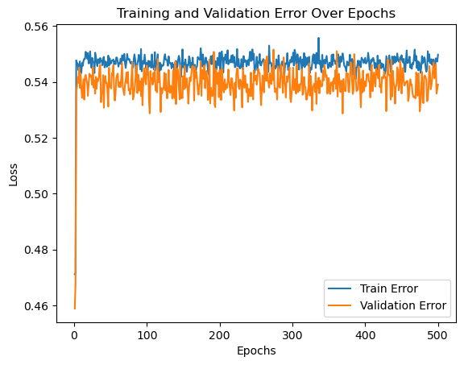
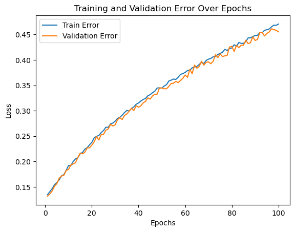
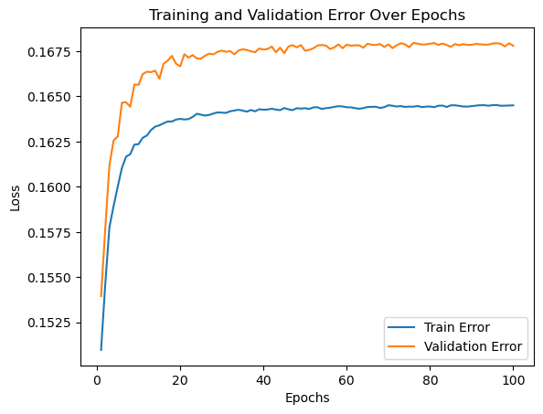
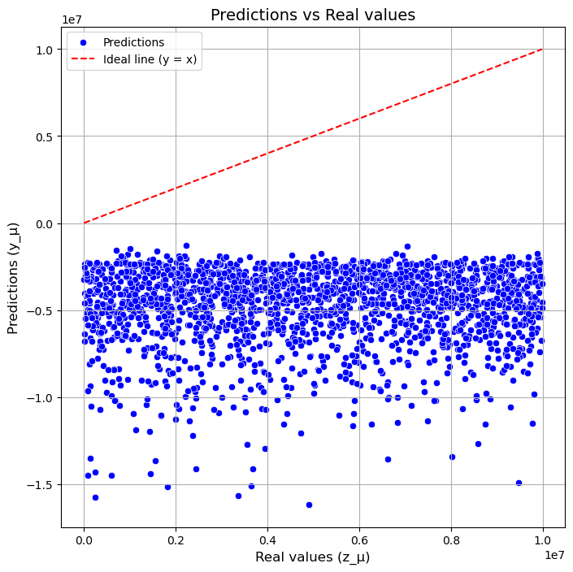
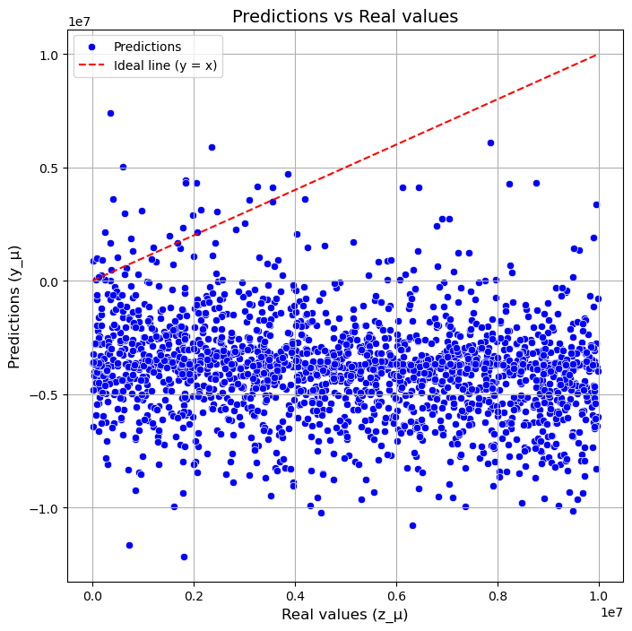
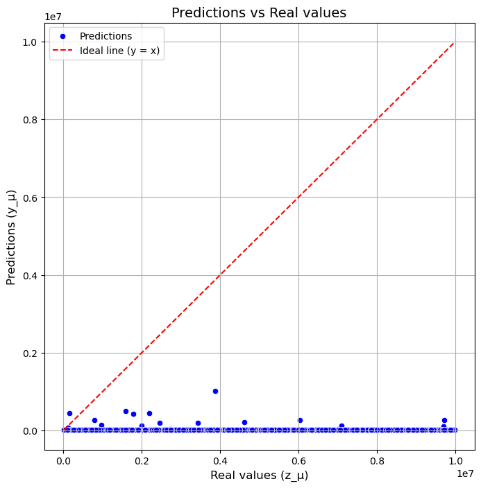
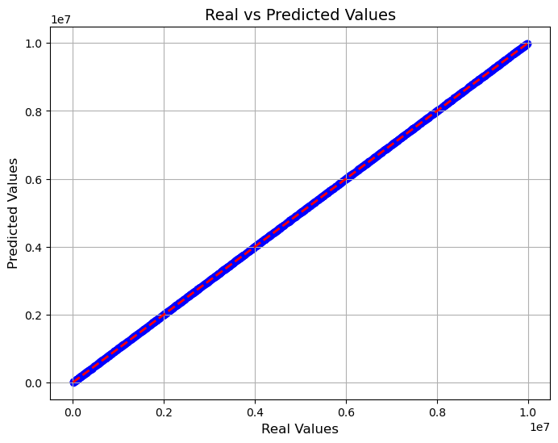

# House Price Prediction in Paris

This repository contains the development of a project aimed at predicting house prices in Paris using neural networks. The project includes the implementation of a neural network from scratch and its comparison with more traditional models, such as a neural network from **tensorflow** and a multiple linear regression model.
This document will describe the processes followed, the results obtained, the comparison of the different models and finally the conclusions obtained.

## Repository Structure

1. **Dataset**  
   The dataset used for this project is available at [https://www.kaggle.com/datasets/mssmartypants/paris-housing-price-prediction]. It contains detailed information about the features of houses and their corresponding prices in Paris.

2. **Project Structure**  
     - `Data_Procesing.ipynb`: Exploratory Data Analysis to understand the dataset's features, clean the data, and perform initial visualizations.  An extended explanation of the methods used can be found in the Data Processing notebook.  
     - `BP_implementation.ipynb`: Implementation of a neural network from scratch 
     - `NeuralN.ipynb`: Implementation of a neural network using the **tensorflow** library for comparison purposes.  
     - `MLR.ipynb`: Implementation of a multiple linear regression model for performance comparison.  
   
   - **`src/`**: Source code including:
     - `NeuralNet.py`: Modular implementation of the neural network from scratch.  
     - `functions.py`: Helper functions for data preprocessing and metric calculations.  

   - **`Results/`**: Folder containing plots generated in the implementation of the diferent hiperparameters  

3. **Project Objective**  
The objective is to build a model capable of accurately predicting housing prices in Paris. Additionally, we aim to compare this model with existing models to evaluate their performance, draw conclusions about their effectiveness  

## Neural Network Explanations

The **`NeuralNet`** class is a modular implementation of a neural network from scratch. In order to implement the neural network, the following steps outlined in the provided document have been followed: Below is a detailed explanation of its methods and functionalities:

#### **Class Initialization (`__init__`)**
**Purpose:**  
Sets up the neural network's structure and initializes weights, biases, and other parameters.  

**Parameters:**  
- `layers`: List defining the number of neurons in each layer, including input and output layers.
- `activation`: Activation function for the hidden layers. Options: "sigmoid", "relu", "leaky_relu", "linear", and "tanh".
- `output_activation`: Activation function for the output layer. Options: "linear", "relu", and "leaky_relu".
- `lr`: Learning rate used for weight updates during training.
- `momentum`: Momentum factor for accelerating weight updates and smoothing convergence.
- `validation_split`: Proportion of data to reserve for validation during training.
- `l2`: L2 regularization coefficient to prevent overfitting by penalizing large weights.
- `dropout_rate`: Dropout rate for hidden layers to randomly deactivate neurons during training and prevent overfitting.

---

#### **`split_data`**
**Purpose:**  
Divides the dataset into training and validation sets based on the `validation_split` ratio.  

**Parameters:**  
- `X`: Input features.  
- `y`: Corresponding labels.  

**Returns:**  
- `X_train`, `y_train`: Training data.  
- `X_val`, `y_val`: Validation data (if validation is enabled).  

---

#### **`activation`**
**Purpose:**  
Applies the chosen activation function to compute activations for neurons in a layer.  

**Parameters:**  
- `z`: Input to the activation function.  
- `output_layer`: Indicated if the activation applies to the output layer.   

---

#### **`activation_derivative`**
**Purpose:**  
Computes the derivative of the activation function, which is used for calculating gradients during backpropagation.  

**Parameters:**  
- `z`: Input to the derivative function.  
- `output_layer`: Indicated if the activation applies to the output layer.   

---

#### **`forward_propagation`**
**Purpose:**  
Performs forward propagation to compute activations for all layers, including the final output. Dropout is applied in hidden layers if specified.  

**Parameters:**  
- `x`: Input feature vector.  

**Returns:**  
The network's output for the given input.

---

#### **`backward_propagation`**
**Purpose:**  
Performs backpropagation to compute gradients of weights and biases and updates them using gradient descent, momentum, and L2 regularization.  

**Parameters:**  
- `x`: Input feature vector.  
- `y`: Target value for the input.  

---

#### **`fit`**
**Purpose:**  
Trains the neural network using forward and backward propagation over a specified number of epochs. Tracks the evolution of training and validation errors.  

**Parameters:**  
- `X`, `y`: Training dataset (features and labels).  
- `X_val`, `y_val` (optional): Validation dataset.  
- `epochs`: Number of iterations to train the model.  

---

#### **`predict`**
**Purpose:**  
Generates predictions for a set of inputs by performing forward propagation.  

**Parameters:**  
- `X`: Input features.  

**Returns:**  
Predicted values for the inputs.

---

#### **`loss_epochs`**
**Purpose:**  
Provides the evolution of training and validation errors across epochs, useful for visualizing the training process.  

**Returns:**  
An array containing the training and validation errors for each epoch.

---

#### **`cross_validate`**
**Purpose:**  
Performs k-fold cross-validation to evaluate the model's performance. Splits the data into `k` folds, trains the model on `k-1` folds, and validates on the remaining fold.  

**Parameters:**  
- `X`, `y`: Dataset (features and labels).  
- `k`: Number of folds for cross-validation.  
- `epochs`: Number of training epochs for each fold.  

**Returns:**  
Metrics such as Mean Squared Error (MSE), Mean Absolute Error (MAE), and Mean Absolute Percentage Error (MAPE) for each fold, along with their mean and standard deviation.  

### Regularization techniques
In this project, two regularization techniques were used to improve the model's generalization ability and prevent overfitting: L2 regularization and Dropout

#### **`L2 Regularization`**

L2 regularization helps to reduce overfitting by adding a penalty to the loss function. This penalty is based on the size of the weights, discouraging the model from assigning too much importance to any specific weight.

In the implementation, the L2 regularization is applied during the **backpropagation step** when the weights are updated. The strength of this penalty is controlled by the `l2` parameter. Larger values of `l2` make the penalty stronger, which helps reduce overfitting even more.

From the table below, we can see:
- **Without L2 regularization (ID 1, 2, 5 models):** The models had higher MAPE values, which indicates overfitting. 
- **With L2 regularization (`L2 = 0.001` or `L2 = 0.0001`):** The models (ID 3 and 4) performed better, with lower MAPE and MAE values. 

Adding a small L2 penalty helped the model generalize better by preventing the weights from becoming too large.

---

#### **`Dropout`**

Dropout is a technique used to reduce overfitting. During training, it randomly "drops" some neurons, setting their activations to zero. This prevents the model from depending too much on specific neurons, forcing it to learn more general features.

In the implementation, dropout is applied during the **forward propagation step**. Neurons are randomly dropped based on the dropout rate, and the remaining activations are adjusted to keep the total contribution balanced.

Experiments were done with dropout rates of **0.2** and **0.3**:
- **Dropout rate of 0.2:** This value worked well in simpler models (e.g., ID 1, 2, 5). 
- **Dropout rate of 0.3:** This higher rate (e.g., ID 3, 4, 8) helped reduce overfitting further by making the model use a wider variety of neurons. However, since the network is simple, this value was carefully chosen to avoid dropping too many neurons.

In general, using a dropout rate of 0.3 provided better results in terms of generalization, as shown by lower MAPE and MAE values in the table.

### Results of the experiments performed

The following table presents the parameters used during the training of the model and the results obtained on the test set. It highlights how the different models performed when making predictions.

| ID | Number of Layers | Layer Structure | Num Epochs | Learning Rate | Momentum | Activation Function | Activation Function (Output Layer) | MAPE     | MAE         | MSE               | L2     | Dropout |
|----|------------------|-----------------|------------|---------------|----------|---------------------|-------------------------------------|----------|-------------|-------------------|--------|---------|
| 1  | 4                | 16,10,10,1     | 200        | 0.001         | 0.5      | relu                | linear                              | 265.31%  | 7300156.53  | 64627050010751.8  | 0      | 0.2     |
| 2  | 4                | 16,32,16,1     | 200        | 0.001         | 0.5      | relu                | linear                              | 463.90%  | 9378038.32  | 99795138409898.02 | 0      | 0.2     |
| 3  | 4                | 16,10,10,1     | 100        | 0.0001        | 0.2      | leaky_relu          | linear                              | 395.67%  | 8126231.09  | 75349488888103.64 | 0.001  | 0.3     |
| 4  | 4                | 16,10,10,1     | 200        | 0.0001        | 0.2      | leaky_relu          | linear                              | 636.60%  | 10690319.56 | 125597528208193.16| 0.001  | 0.3     |
| 5  | 4                | 16,10,10,1     | 200        | 0.001         | 0.9      | relu                | linear                              | 428.45%  | 9514410.67  | 106176411584698.06| 0      | 0.2     |
| 6  | 4                | 16,10,10,1     | 500        | 0.01          | 0.9      | relu                | linear                              | 489.76%  | 9800347.71  | 108816790015609.6 | 0      | 0.2     |
| 7  | 4                | 16,16,8,1      | 200        | 0.0001        | 0.5      | relu                | linear                              | 454.9%   | 9650105     | 106931750550469.27| 0      | 0.2     |
| 8  | 4                | 16,16,8,1      | 100        | 0.00001       | 0.2      | leaky_relu          | leaky_relu                          | 393.68%  | 8893652.31  | 94133748386048.77 | 0.0001 | 0.3     |
| 9  | 4                | 16,16,8,1      | 100        | 0.00001       | 0.2      | leaky_relu          | relu                                | 98.86%   | 4974904.87  | 33357713009219.14 | 0.0001 | 0.3     |
| 10 | 4                | 16,16,8,1      | 200        | 0.001         | 0.2      | relu                | leaky_relu                          | 100.42%  | 4989155.2   | 33480321692286.88 | 0      | 0.3     |

To improve the evaluation process of the models, **k-fold cross-validation** was implemented. This approach divides the dataset into k equally sized folds, ensuring that every sample in the dataset is used both for training and validation. TO do this, the dataset was divided into k=5 folds for cross-validation. For each fold, the model was trained using k-1 folds and validated on the remaining fold. This process was repeated for all k folds to ensure that every data point was included in the validation set exactly once. 

To evaluate the performance of different models using k-fold cross-validation, the following table summarizes the results for each model. Most models used 5 folds (k=5), while Model 2 used 3 folds (k=3) due to issues with gradient explosion that caused error values to spike. In these cases, using a smaller k helped prevent the instability and allowed the model to perform more consistently during training.

| Model ID | MSE Mean | MSE Std | MAE Mean | MAE Std | MAPE Mean | MAPE Std | K-Fold |
|----------|----------|---------|----------|---------|-----------|----------|--------|
| 1        | 0.7143   | 0.0764  | 0.7811   | 0.0447  | nan       | nan      | 5      |
| 2        | 16.796   | 0.398   | 11.921   | 0.1482  | nan       | nan      | 3      |
| 3        | 0.7982   | 0.1492  | 0.8173   | 0.0759  | nan       | nan      | 5      |
| 4        | 1.116    | 0.1636  | 0.9897   | 0.0690  | nan       | nan      | 5      |
| 5        | 0.6893   | 0.150   | 0.7658   | 0.0842  | nan       | nan      | 5      |
| 6        | 0.9719   | 0.1795  | 0.924    | 0.0892  | nan       | nan      | 5      |
| 7        | 0.7768   | 0.0970  | 0.8175   | 0.0594  | nan       | nan      | 5      |
| 8        | 0.3327   | 0.0096  | 0.5006   | 0.0095  | nan       | nan      | 5      |
| 9        | 0.3298   | 0.0039  | 0.4976   | 0.0026  | nan       | nan      | 5      |
| 10       | 0.3339   | 0.0014  | 0.5017   | 0.0023  | nan       | nan      | 5      |

Based on the data, Model ID 9 demonstrates the best generalization performance to unseen data. It achieves the lowest MSE Mean (0.3298), indicating it makes the most accurate predictions on average. Additionally, it has the smallest MSE Std (0.0039), suggesting it is consistent and stable across different folds in the cross-validation process. This aligns with the results observed in the earlier table, which measured the performance of each model on the test data.

#### Visualizing Model Performance
To better understand the behavior and performance of the models during training and evaluation, the following visualizations are included:

**1. Loss Evolution**
The first set of images shows the evolution of the loss function in both train and validation data for three different models during training.

| Model ID  6              | Model ID  8             | Model ID  9               |
|------------------------|-----------------------|-----------------------|
|  |  |  |

**2. Test Results**
Example of the predictions made by each of the models compared to actual values.

| Model ID  6               | Model ID  8               | Model ID  9               |
|------------------------|-----------------------|-----------------------|
|  |  |  |

## Models comparison

### 1. Neural Network using Keras
To compare the performance of the custom neural network with a more traditional approach, we implemented a neural network using Keras. The model was trained using the training set, with a validation set provided for monitoring performance during training. The model was trained for 250 epochs, and a batch size of 32 was used.The batch size is an hyperparameter that controls the number of training examples used in one forward/backward pass. The parameters used to train the neural network with which the best results were obtained are presented below:

- **Architecture:**
  - Input layer: Accepts input features with shape `(df_train_x.shape[1],)`
  - Hidden Layer 1: 64 neurons with ReLU activation
  - Hidden Layer 2: 32 neurons with ReLU activation
  - Output Layer: 1 neuron 

- **Optimizer:** Adam with a learning rate of `0.001`
- **Loss Function:** Mean Squared Error (MSE)

### 2. Multi Lineal Regression
Aso, a linear regression model was implemented using scikit-learn model, this model directly fits the input features to the target variable. During this step, the algorithm minimizes the mean squared error (MSE) between the predicted values and the actual target values.

A key advantage of this model is its easy interpretability. It assumes a linear relationship between the features and the target variable, with the coefficients providing insight into the contribution of each feature to the prediction. For example, in this linear model, the feature 'haspool' has the highest coefficient, indicating that it has the greatest influence on the final prediction.

### Comparative table
To compare the performance of the three prediction methods, we used the model with ID9 from the previously presented models, as it achieved the best results. This model was then compared to the TensorFlow implementation and the multiple linear regression model.

| Model                | MAPE   | MAE        | MSE             |
|----------------------|--------|------------|-----------------|
| Implementation of BP | 98.86  | 4974904.87 | 33357713009219.14 |
| Neural Network       | 5.17   | 10348.99   | 378670745.9     |
| MLR                  | 0.114  | 1433.7     | 3431211.2       |

### Plot of predicted vs real values
The following plot compares the actual vs predicted values. The closer the data points are to the diagonal line, the better the model's predictions, indicating a higher degree of accuracy. Ideally, the points should lie along or near the line, meaning the predicted values are very close to the actual values. From the plot, we can observe that both the TensorFlow neural network model and the multiple linear regression (MLR) model closely follow the diagonal line, indicating strong prediction accuracy. On the other hand, the model implemented from scratch shows significant deviations, suggesting it struggles with prediction.

| Neural Network              | MLR                   | Model ID 9               |
|------------------------|-----------------------|-----------------------|
|  |  |  |

## Conclusions

In the first model, where the neural network was implemented from scratch, the results showed that the backpropagation algorithm did not work properly. Across different experiments, the loss values increased instead of decreasing, indicating that the model was not learning. The network had significant problems with convergence and often suffered from exploding gradients, especially when using a high number of neurons. Additionally, the weight initialization had to be adjusted, as improper initialization caused the error to remain constant, showing no improvement during training. Overall, this implementation faced serious challenges in achieving reliable results.

When comparing the models, the multiple linear regression (MLR) model performed better than both the TensorFlow neural network and the neural network implemented from scratch. The MLR model had the smallest errors, was easier to implement, and required less computational effort. This could be because the dataset was relatively simple, meaning a straightforward model like MLR was sufficient to capture the relationships in the data. On the other hand, while the TensorFlow neural network provided reasonable predictions, it was more complex to implement and did not perform better than the simpler MLR model.

